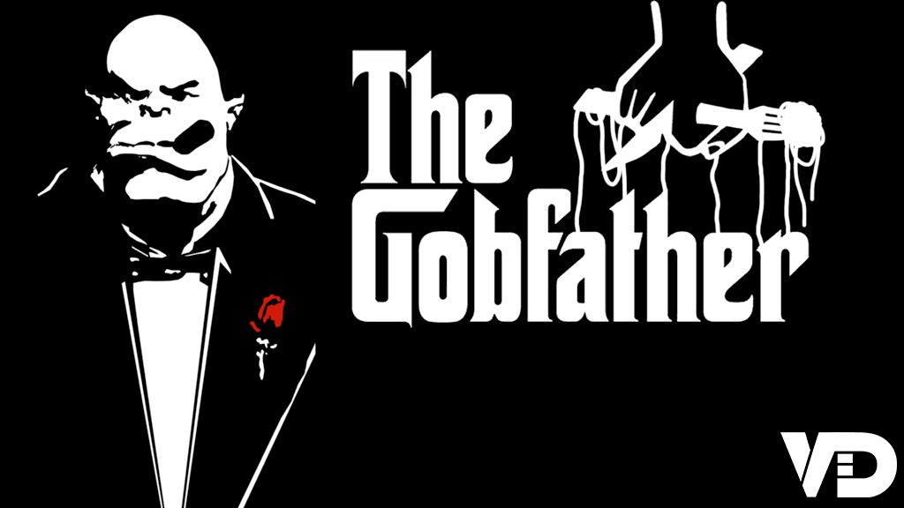
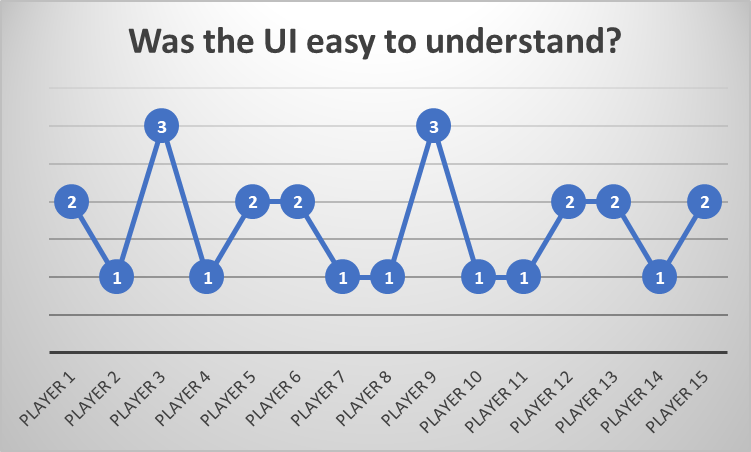
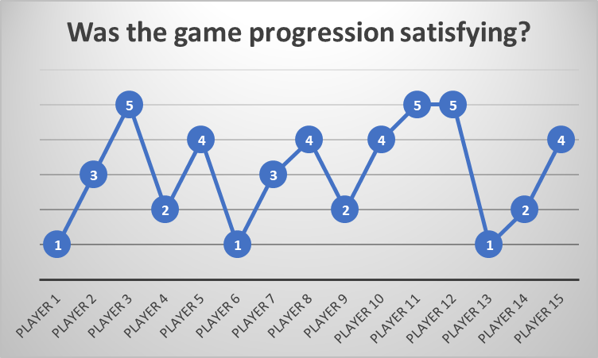
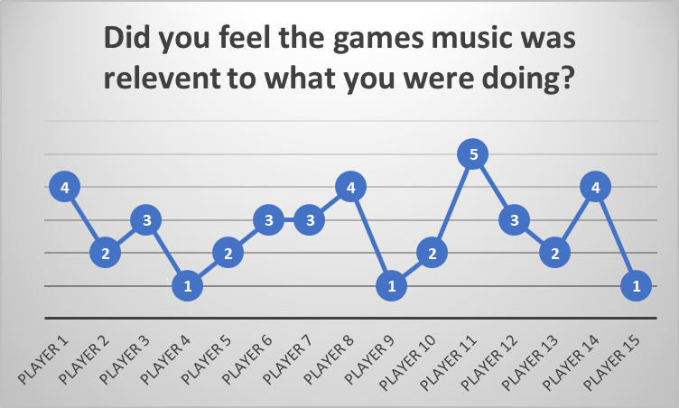

```markdown
Are you ready for some extreme pun-ishment? Well then try out team VDs 
newest game The Gobfather. This game has everything you could ever want 
out of a top-down bullet HELL, such as Orcs to kill, bad puns and 
so... many... pizzas...

Witness a collective of bad ideas such as an unhealthy obsession with 
pizza, puns and pills.

The VD bar is one of the most unique features of the game, a mechanic
wherein you have to work fast to keep your Vitamin D levels high for 
the best chance for premium loot!

But if think popping a few pills is the only interesting thing in this 
game you would be mistaken, there is plenty to keep the mind occupied 
from table flipping for when the meal just wasn't good enough and it 
makes you mad to a Boss battle where he won't wait for you to come to 
him, he will surf the pizza all the way to you! And with the maps being 
procedurally generated you will have a new experience every time.

Playing this game is like drinking a fine wine filled with interesting 
flavours but you might not know what colour it should be by the end. 
One of our games interesting 'flavours' is the unique aesthetic to the 
cell shaded art helping it to look crisp and sweet. Another 'flavour' 
would be the replayability that the weapons and other collectables 
provide giving a nice fruity twist, with the final few drops of the 
bottle providing a dash of competitiveness though the scoring system.

Think your hard-core enough to take on the Orc Mafia? Only the pun-iest 
people have made it to the end and survived.
```

Follow link for download: [The Gobfather](https://sparky439.itch.io/the-gobfather).

### Summary

The Gobfather is a stylised top-down bullet hell shooter where the 
character fights their way through an Italian restaurant run by the
mafia. It uses procedural generation to randomize the layout of the 
dungeons, and there is a big emphasis on the random nature of the
gun drops and how you can get more powerful weapons as you progress
through the game. I used a combination of both quantitative and 
qualitative forms of data gathering to try and get a picture of what
people like and don't like about different features of the game.

### Methodology

One method that I used to gather data was asking random people to 
play through the game and answer a few questions based on their 
experience of the game and what they thought was good or bad.
They filled out a questionnaire that asked them to rate different
aspects of the game on a scale of 1 to 5. This gave me a good set
of anonymous quantitative data that I could chart and start to see
patterns in.

I then asked different people on my course to give me more formal
and detailed feedback on the game to try and get a more in-depth
idea on the areas of the game that need improving, I then tried
to categorise these more detailed answers to try and get a better
picture of how to change the game for the better.

### Results

Looking at the results from the anonymous servey a few interesting 
points were raised, one being about the users understanding of the
user interface and how it wasn't the easiest to figure out the 
information it was trying to convey.

As the graph above shows the highest number given was a 3 with the
majority of the answers being either a 1 or a 2. This gives a clear
message that changes need to be made to the design of the UI to make
it easier to understand.

Another



m

A third



m

### Recommendations

My recommendations based on the results of the data that I 
gathered are:
- Change the UI to make it more coherent.
- Change the way the levels progress to give a better sense of progression.
- Increase the number of music tracks to make them feel more relevant to the users actions.

### To Conclude

While a lot of people liked --- a lot of people thought that --- 
was not that good and could be improved

```
Written by: Nathan-David Coplestone Last Updated: 18/03/2019
```
